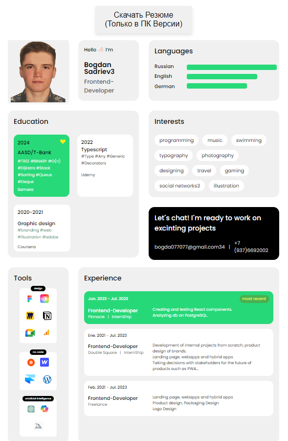

# Вступительный экзамен для Front-end разработчика

## Структура проекта

```

├── assets

  ├── img

      └── SVG,PNG files

  └── style

      └── CSS files

├── js

  └── main.js

└── index.html
```

---

## Введение

Проект является заявкой на вступительный экзамен для Front-end разработчика в Т-Банк. Цель состояла в создании веб-страницы с резюме на основе предоставленного шаблона. Страница включает редактируемые текстовые элементы и кнопку "Скачать" для сохранения резюме в формате PDF. Кроме того, были реализованы кнопки регулирования масштаба страницы, для удобства просмотра на любых устройствах.

---

## Выполненные задачи

1. **Макет на основе шаблона**: Создан макет веб-страницы с резюме на основе предоставленного [макета Figma](https://www.figma.com/design/9dYuOP8UuD8hmcutZm26Ms/Example-land?node-id=0-1&t=UnhjBxtVduuxmxUK-0).
2. **Редактируемые текстовые элементы**: Реализована возможность редактирования текстовых элементов прямо на странице резюме с сохранением изменений.
3. **Скачивание PDF**: Добавлена кнопка "Скачать", которая преобразует текущую версию резюме в формат PDF и загружает его на компьютер пользователя.
4. **CSS-анимации**: Все изменения элементов резюме анимированы с помощью CSS для создания плавного пользовательского опыта.
5. **Эффект "Material Wave"**: Реализован эффект "Material Wave" для только что измененных элементов.
6. **Адаптивный дизайн**: Обеспечено корректное отображение страницы на различных устройствах и разрешениях экрана.
7. **Оптимизация производительности**: Обеспечено сохранение данных в случае обновления страницы.

---

## Дополнительные требования

- **Библиотеки для преобразования HTML в PDF**: Использованы библиотеки, такие как `jspdf/html2canvas`, для облегчения генерации PDF.
- **Базовые технологии**: Разработка выполнена с использованием HTML, CSS и JavaScript без использования сторонних библиотек и фреймворков.
- **Качество кода JavaScript**: Использованы инструменты, такие как [JSHint](https://jshint.com) и [ESLint](https://eslint.org), для обеспечения качества кода и соответствия стандартам.
- **Форматирование кода**: Использован [Prettier](https://prettier.io) для автоматического форматирования кода, чтобы поддерживать читаемость и согласованность.

---

## Ссылки

- **Подробнее о себе**: [мой сайт](https://b0gda.github.io/)
- **Макет Figma**: [макет сайта Figma](https://www.figma.com/design/9dYuOP8UuD8hmcutZm26Ms/Example-land?node-id=0-1&t=UnhjBxtVduuxmxUK-0)

---

## Пример веб-страницы


